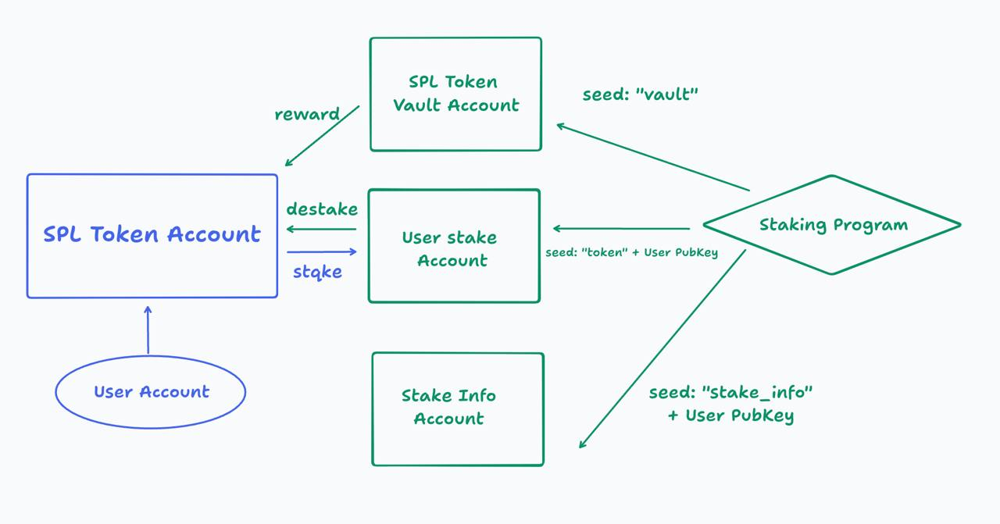

# Solana SPL Token Staking Program in Rust(Anchor)

This project implements a Solana SPL token staking program using the Anchor
framework. The program allows users to stake their SPL tokens, earn rewards
based on the staking duration, and unstake their tokens along with the earned
rewards.

## Features

- Stake SPL tokens to a user-specific stake account
- Calculate rewards based on staking duration (1 token per slot)
- Unstake tokens and receive rewards
- Utilizes Solana's Program Derived Addresses (PDAs) for secure token management
- Stake info account to store staking time and staked state for each user

## Program Structure

The program consists of three main instructions:

1. `initialize`: Sets up the token vault account for storing rewards
2. `stake`: Allows users to stake their SPL tokens
3. `destake`: Allows users to unstake their tokens and receive rewards

## Accounts

- `token_vault_account`: Stores the reward tokens
- `stake_info_account`: Stores staking information for each user
- `stake_account`: Holds the staked tokens for each user
- `user_token_account`: The user's SPL token account

## Account Structure



The image above illustrates the account structure of the staking program:

1. SPL Token Account (Associated Token Account):

   - Owner: User Account

2. SPL Token Vault Account:

   - Owned by: Staking Program
   - Stores reward tokens

3. Stake Info Account:

   - Owned by: Staking Program
   - Stores staking information for each user

4. User-specific Stake Account:
   - Owned by: Staking Program
   - Holds staked tokens for each user

Note: The SPL Token Vault Account, Stake Info Account, and User-specific Stake
Account are all owned by the Staking Program.

## Getting Started

1. Install dependencies:

   ```
   npm install
   ```

2. Build the program:

   ```
   anchor build
   ```

3. Deploy the program to your desired Solana cluster (devnet, testnet, or
   mainnet):

   ```
   anchor deploy
   ```

4. Run tests:
   ```
   anchor test
   ```

## Test Setup

Before running the tests, you need to create an SPL token mint and use its
secret key in the test file. Follow these steps:

1. Uncomment the `createMintToken()` function call in the first test.
2. Run the test once to create the mint:
   ```
   anchor test
   ```
3. Copy the generated mint secret key from the console output.
4. Replace the `mintKeypair` in the test file with the copied secret key:
   ```typescript
   const mintKeypair = Keypair.fromSecretKey(
     new Uint8Array([
       // Paste the copied secret key here
     ]),
   );
   ```
5. Comment out the `createMintToken()` function call again.
6. Now you can run the full test suite:
   ```
   anchor test
   ```

## Future work

To enhance this project, we plan to:

1. Develop a frontend application to interact with the Solana Anchor program:
   - Create a user-friendly interface for staking and unstaking tokens
   - Display real-time staking information and rewards
   - Implement wallet connection functionality

## License

This project is licensed under the MIT License.
